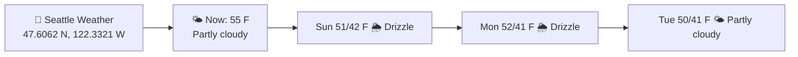

<!-- weather:start -->

```mermaid
flowchart LR
    T["🌲 Seattle Weather\n47.6062 N, 122.3321 W"]
    N["🌤️ Now: 55 F\nPartly cloudy"]
    D1["Sun 51/42 F 🌦️ Drizzle"]
    D2["Mon 52/41 F 🌦️ Drizzle"]
    D3["Tue 50/41 F 🌤️ Partly cloudy"]
    T --> N --> D1 --> D2 --> D3
```
<!-- weather:end -->

## About

I'm a DevOps/Site-Reliability Engineer who builds high-performance systems and developer tooling, with a focus on observability
